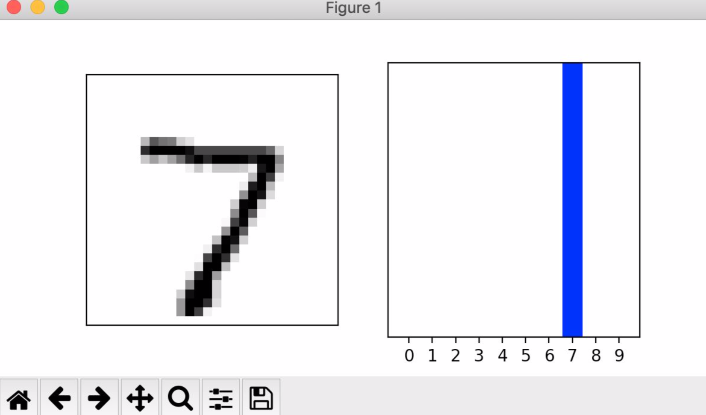
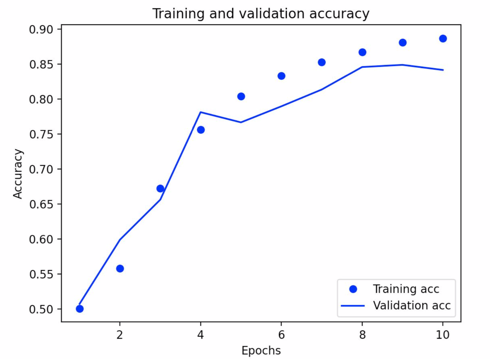
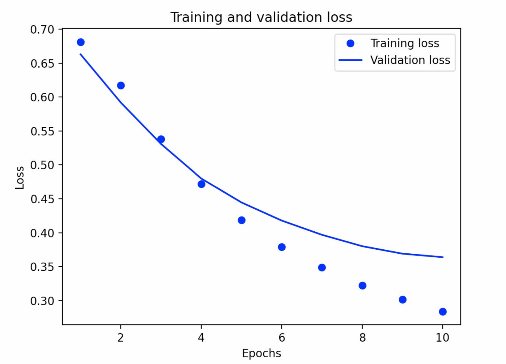

# response-ml

Machine Learning Responses:

## 7/7 Daily Response

1. Traditional programming takes an input of data and rules, and gives an output of answers. Machine learning, on the other hand, takes an input of answers and data, and gives an output of rules. In other words, from the given answers and data, it tries to link the two together.

2. The first answer I got was 12.999944, and the second was 12.999991. They are different because there is a limited amount of data to train on. However they are very very close to each other since they are a part of the training data, and therefore whatever pattern (line) is found, most likely fully applies to it as well. 

3. The best deal (not including things like remodeling) would be the Hudgins house since its price (per room) is about $137,000 less than predicted. The worst  deal would be the house of Church since it is about $100,000 more than predicted.

## 7/8 Daily Response

1. The training data is used to train the neural network, the testing data (remaining data) is used to see how well the network performs on other images/data that is new/not familiar. The purpose is to teach the computer to pick up patterns/equations, and be able to use them independently. The images variables are pixel arrays while the labels are numbers which represent the clothing.

2. Relu helps ensure that there are no negative numbers. So it sets any number that is less than 0, to 0. Softmax is usually used in the last layer, and sets the largest value to 1, and the rest to 0. This helps find the most likely answer since less data needs to be sorted through. There are 10 neurons in the last layer because there were 10 pieces of clothing, they are the output. Each neuron gives the probability that its correlated article is in the class.

3. The loss function finds the amount of error and works to minimize it. The optimizer then looks at the results from the loss function, and attempts to make another estimate with less error. The loss function will then analyze it, and the cycle continues. The loss function is categorical because the items which are being analyzed are also categorical. You cannot really measure them continuously.

4a. Whatistheshapeoftheimagestrainingset:​(60,000,28,28)

4b. Whatisthelengthofthelabelstrainingset?​6000

4c. What is the shape of the images test set? (1000,28,28)

4d. Estimate a probability model and apply it to the test set in order to
produce the array of probabilities that a randomly selected image is
each of the possible numeric outcomes:
array([1.5539440e-09, 8.2805976e-12, 4.7423885e-07, 4.3320365e-06,
1.9139490e-12, 2.6702085e-10, 1.1747801e-14, 9.9999344e-01, 1.0673884e-06, 7.2961376e-07], dtype=float32)

4e. Use np.argmax() with your predictions object to return the numeral with the highest probability from the test labels dataset: 7

4f. 

## 7/9 Daily Response

1. TF hub is a hub of datasets in the cloud that we are using and accessing. We bring it down to our local computers, and then use it’s data of movie reviews for our own modeling purposes.

2. The loss function we used is ‘BinarlyCrossentropy’. Loss functions measure the amount of error, and work to decrease it with each epoch, therefore bettering the model. The optimizer function used was ‘adam’. This works with the loss function by creating new estimations based on the output of the loss function. The loss function then analyses the new estimation and a cycle begins. The model turned out pretty well, but not great. It had an accuracy of 0.857 and a loss of 0.321.

3. The graph below demonstrates my training and validation loss. It decreases which shows that the model is improving, and there are fewer errors. The training loss performed better than the validation loss (you can tell because the dots are lower than the line as you move towards 10 epochs), but that is to be expected.

4. The below graph is my training and validation accuracy graph. This is increasing, since the accuracy increases with each epoch. The validation accuracy did not perform as well as the training accuracy, but this is to be expected. You can tell because the validation accuracy line is not smooth and jets out in places. This is not to say it is not accurate -- it still generally follows the training accuracy.

## Project 1
1. In general, yes, it was effective at detecting potential violations. However, I would not recommend it be used for official purposes as actual distances were not accurately portrayed.

2. I think that this approach as a concept sounds more useful than it really is. As mentioned under the “Limitations and future improvements” section, the detector and camera calibration are not perfectly coordinated. This difference causes a gap between distances in real life, and the distance that is detected in the output video. It would also help if the camera were higher, this would make it easier to tell differences in space. Other factors, such as wind would also affect potential infections. Though most experts agree that Covid spreads through tiny droplets, they are still debating whether it is airborne This is something that can be recorded (direction and mph), but is very hard to incorporate into the computer's calculations since wind is so uncontrollable  and unpredictable. Who is to say what a certain gust would do? I think this approach would be helpful for cities. Many are attempting to reopen, and by using this camera and detector, officials could see general trends about whether people are following social distancing rules or not. This could help them predict the number of hospitalizations in the next few weeks, as well as decide if their citizens are responsible enough to handle a reopening. 

3. I would apply all ideas in the “Limitations and future improvements” section. For privacy reasons, I would probably try to blur out any detected faces. Based on the US’s response thus far, the government will not be tracking down specific people who were caught violating social distancing on such cameras. As mentioned in class, it is slightly disturbing to realize after the fact that you were being recorded -- this would help clear away any privacy concerns. 

