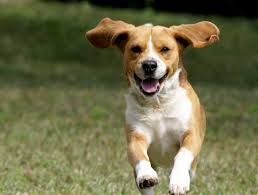

Machine Learning Responses:

## 7/7 Daily Response

1. Traditional programming takes an input of data and rules, and gives an output of answers. Machine learning, on the other hand, takes an input of answers and data, and gives an output of rules. In other words, from the given answers and data, it tries to link the two together.

2. The first answer I got was 12.999944, and the second was 12.999991. They are different because there is a limited amount of data to train on. However they are very very close to each other since they are a part of the training data, and therefore whatever pattern (line) is found, most likely fully applies to it as well. 

3. The best deal (not including things like remodeling) would be the Hudgins house since its price (per room) is about $137,000 less than predicted. The worst  deal would be the house of Church since it is about $100,000 more than predicted.

## 7/8 Daily Response

1. The training data is used to train the neural network, the testing data (remaining data) is used to see how well the network performs on other images/data that is new/not familiar. The purpose is to teach the computer to pick up patterns/equations, and be able to use them independently. The images variables are pixel arrays while the labels are numbers which represent the clothing.

2. Relu helps ensure that there are no negative numbers. So it sets any number that is less than 0, to 0. Softmax is usually used in the last layer, and sets the largest value to 1, and the rest to 0. This helps find the most likely answer since less data needs to be sorted through. There are 10 neurons in the last layer because there were 10 pieces of clothing, they are the output. Each neuron gives the probability that its correlated article is in the class.

3. The loss function finds the amount of error and works to minimize it. The optimizer then looks at the results from the loss function, and attempts to make another estimate with less error. The loss function will then analyze it, and the cycle continues. The loss function is categorical because the items which are being analyzed are also categorical. You cannot really measure them continuously.

4a. What is the shape of the images training set:​(60,000,28,28)

4b. What is the length of the labels training set?​6000

4c. What is the shape of the images test set? (1000,28,28)

4d. Estimate a probability model and apply it to the test set in order to
produce the array of probabilities that a randomly selected image is
each of the possible numeric outcomes:
array([1.5539440e-09, 8.2805976e-12, 4.7423885e-07, 4.3320365e-06,
1.9139490e-12, 2.6702085e-10, 1.1747801e-14, 9.9999344e-01, 1.0673884e-06, 7.2961376e-07], dtype=float32)

4e. Use np.argmax() with your predictions object to return the numeral with the highest probability from the test labels dataset: 7

4f. 

## 7/9 Daily Response

1. TF hub is a hub of datasets in the cloud that we are using and accessing. We bring it down to our local computers, and then use it’s data of movie reviews for our own modeling purposes.

2. The loss function we used is ‘BinarlyCrossentropy’. Loss functions measure the amount of error, and work to decrease it with each epoch, therefore bettering the model. The optimizer function used was ‘adam’. This works with the loss function by creating new estimations based on the output of the loss function. The loss function then analyses the new estimation and a cycle begins. The model turned out pretty well, but not great. It had an accuracy of 0.857 and a loss of 0.321.

3. The graph below demonstrates my training and validation loss. It decreases which shows that the model is improving, and there are fewer errors. The training loss performed better than the validation loss (you can tell because the dots are lower than the line as you move towards 10 epochs), but that is to be expected.

4. The below graph is my training and validation accuracy graph. This is increasing, since the accuracy increases with each epoch. The validation accuracy did not perform as well as the training accuracy, but this is to be expected. You can tell because the validation accuracy line is not smooth and jets out in places. This is not to say it is not accurate -- it still generally follows the training accuracy.

## Project 1

link to project 1 video: https://youtu.be/7sHHVERLgNw

1. In general, yes, it was effective at detecting potential violations. However, I would not recommend it be used for official purposes as actual distances were not accurately portrayed.

2. I think that this approach as a concept sounds more useful than it really is. As mentioned under the “Limitations and future improvements” section, the detector and camera calibration are not perfectly coordinated. This difference causes a gap between distances in real life, and the distance that is detected in the output video. It would also help if the camera were higher, this would make it easier to tell differences in space. Other factors, such as wind would also affect potential infections. Though most experts agree that Covid spreads through tiny droplets, they are still debating whether it is airborne This is something that can be recorded (direction and mph), but is very hard to incorporate into the computer's calculations since wind is so uncontrollable  and unpredictable. Who is to say what a certain gust would do? I think this approach would be helpful for cities. Many are attempting to reopen, and by using this camera and detector, officials could see general trends about whether people are following social distancing rules or not. This could help them predict the number of hospitalizations in the next few weeks, as well as decide if their citizens are responsible enough to handle a reopening. 

3. I would apply all ideas in the “Limitations and future improvements” section. For privacy reasons, I would probably try to blur out any detected faces. Based on the US’s response thus far, the government will not be tracking down specific people who were caught violating social distancing on such cameras. As mentioned in class, it is slightly disturbing to realize after the fact that you were being recorded -- this would help clear away any privacy concerns. 

## 7/14 Daily Response

A.
filter = [ [0, 1, 0], [1, -4, 1], [0, 1, 0]]
weight  = 1
The first filter did not emphasize any specific kind of line as the 2nd and 3rd ones did. This image turned out much darker than the others, as if all features were not emphasized, but decreased. 

filter = [ [-1, -2, -1], [0, 0, 0], [1, 2, 1]]
weight  = 1
This filter emphasizes horizontal lines in the image. Just by looking at it, you can tell as the wood supporting the railing is well defined -- much more than in the other images. In addition, in the line ‘filter’ you can see that one bracket contains only 0’s. This indicates that the filter will highlight horizontal features.

filter = [ [-1, 0, 1], [-2, 0, 2], [-1, 0, 1]]
weight  = 1
This filter emphasizes vertical lines in the image. Just by looking at it, you can tell since the structure of the level above where the people are climbing is more defined. In addition, in the line ‘filter’ you can see that each bracket contains 0 as it’s middle number. This indicates that the filter will highlight vertical features. 

When you apply a filter to the original array, you are multiplying it with a cluster of pixels (in this case 9 pixels). The multiplication values are then added to each other. Next, the same process happens to the next cluster of pixels. The filter you chose changes which features are highlighted or hidden. Computer vision is improved by convolutions since convolutions detect features and match them to labels. They highlight certain features of an image, which helps when trying to decipher one thing from another as well as analysis.

B. I applied a 2x2 filter to my convoluted image that shows clear vertical edges. When I applied this filter, it simplified the image by taking clusters of pixels as an input, and then outputting whichever is the largest within the cluster. This decreases the size of the image, but the output image keeps features that were before very clear, maintaining the image. In this example, the clusters are groups of 4. You can tell because in the code, when makinging the list ‘pixels’, x and y are used as a base, and at one point in the list each variable gest a ‘+1’ added to it twice, resulting in 4 pixels (from base, take a step vertically, horizontally, and diagonally to make a square). This method is useful as it simplifies images without letting go of the message of the image. If processing big data, this simplification could help decrease the amount of time a computer will be calculating and analyzing an image. 

 
C. After training and comparing my DNN and CNN output, I was able to improve my model by adding the Conv2D and MaxPooling2D layers. After 10 epochs my DNN had a test accuracy of 0.9771. My CNN had an accuracy of 0.9982. By editing the convolutions by changing the neurons in each layer (32s to 16s and 64s) the more neurons, the longer the longer the training time. In addition, the more neurons, the better the accuracy, however only by a very small amount. If you add more convolutions, more weights are added. This can become problematic as the output (test data) could become more overfit and hence less accurate. The below graph helps visualize convolutions and demonstrates common features such as lines and curves.

## 7/15 Daily Response
Horses and humans
1. You use the  ImageDataGenerator() command to pass directories through. The command will then auto label the images based on the directory name. For it’s arguments, you can use ‘rescale’ to normalize the image. You need to specify the directory, the size of the images (this is ‘target_size’) since you are not guaranteed to have multiple images of the same sizes, the batch size, and the class mode. In this example, we used binary, but if there were more than 2, you use categorical. The difference between doing this to the training vs validation datasets is simply the name. The process is the exact same. 
2. The number of layers is mostly personal preference, although it is encouraged to play around with it a bit in order to find the best results. In my example, as the size of the image decreases, the number of filters increases. The image sizes decrease thanks to the MaxPooling command. This takes a cluster of pixels, chooses the largest one, then uses that as the output. This image is then scanned and analyzed by the next line, which is usually a convolution, or if you choose to stop the cycle, a line which flattens the layer. The activation function which is the output is ‘sigmoid’. This pushes the value in one class towards 0, and the other (in another class) towards 1 (horse or human). This is used since the output also says that there is one output. This is okay since it is all binary and the ‘sigmoid’ activation is present. For the compiler, I used ‘binary_crossentropy’ for loss again. For the optimizer, I used ‘RMSprop()’. This is able to take parameters for the learning rate.

Regression
1. Because the auto.mpg pairwise plot contains 16 plots comparing different attributes, it is very useful for understanding the relationship of the attributes as well as the data. It is good for analysis of the interaction between variables because you can clearly view patterns and ranges in which the data resides. The diagonal access represents the comparison of values to themselves. The pairplot describes that as cylinders increase, the MPG slightly decreases. According to this plot, the peak number of cylinders in relation to MPG is 4 or 5. The relation between MPG and Displacement as well as MPG and Weight is the same as MPG and Cylinders, except much more continuous. The plots describing Cylinders and Displacement as well as Cylinders and Weight are very similar, with both increasing as the number of Cylinders increases. The last relationship, Weight and Displacement shows that as the Weight increases, so does displacement. Only plots with Cylinder as a value were not continuous. 
2. Interestingly enough, line 996 seemed to perform the best. It had the lowest values for almost every category (meaning the lowest amount of loss, absolute error, and mean error). The three lines after line 996 do not perform as well. Also, the training data definitely performed better than the validation data (you can tell since numbers in categories beginning with “val_” are usually larger than their corresponding columns). The plots do demonstrate this. It is much easier to see the difference between the training and validation data as the solid and dotted lines are easier to differentiate than simply numbers. In addition, the histogram which describes prediction errors shows that errors drop off completely, before happening again. The predicted values in the top right corner also vary more than in the middle of the graph. 

Overfit and underfit
1. When comparing the tiny, small, medium and large models, we can clearly see which performs best on testing data without overfitting or underfitting much. We can tell by the similarity of the solid and dotted lines. The closer and more similar they are, the better the model performed. In this case, it is tiny. It also helps demonstrate at which epochs things begin to go amiss, as most of the time validation lines curve upwards drastically. 

## Project 2

For my tee-shirt design, I chose to combine the images of a lightbulb and a rubix cube. I wanted the object of my image to be a lightbulb since it reminds me of all the bright students and ideas that have emerged this summer. I chose a rubix cube as my style image mostly so I could add color to my image. I wanted something that could be nicely integrated into the shirt too, which I think if the shirt is black, this image would be. I can picture my image on the front of a shirt, and then on the back, "Jump Start Data Science Summer Program". 

## 7/20 Daily Response

Problem Statement: 
Every day, decisions are made about a persons risk to society. Whether their first time in prison, or their eighth, based on a persons behavior and past, predictions can be made about a persons probability of hurting society if being let out of prison and ending up back in the prison system. Environment, genetics, past crimes, crime severity, are just a few factor which could influence a persons potential risk. It is plausible that Machine Learning can help make decisions about how much of a risk someone is based off of their own case and past cases. Of course, every person and every situation is different, and computers will not always take into account or understand complex cases, however, by understanding training data, and analyzing more cases from the past than a human brain can recall, Machine Learning is a plausible tool for assessing the risk of letting a person return to society. By looking at recidivism rates in relation to a persons characteristics (not symply physical), computers can help humans figure out which variables are the best predictors for recidivism, helping keep society safe. 

1. I used the optimizer RMSprop(lr=0.001). Unlike RMSprop, Rprop looks at the size of each gradient and compares the size of a single gradient to the size of the gradient next to it. It works to find the right step size. The right step size is found when the two gradients it compares have the same sign. After finding this, the step size is limited and the weight update is applied. However, Rprop works well with full batched, but not small ones. RMSprop, on the other hand works for mini batches since it divides by the root of squared gradient using the moving average. Adagrad is another optimizer that remembers the sum of squared gradients from another dimension and the scales gradients based on that. 

2. The loss function used is binary_crossentropy. This function is effective when there are two classifications. Binary_crossentrophy takes the log probability of a point being either one or the other for it’s predictions. In order to penalize bad decisions, the computer takes the negative log of the probability of the true class; so the better the prediction, the lower the loss. The mean of all the combined losses is found which gives us the binary_crossentropy output. 

3. The metric= argument, [‘acc’] tells us how often predictions equal labels. It compares the testing and training data and outputs its accuracy. 

4. Based on the Training/Validation Accuracy graph (first one) and the Training/Validation Loss graph (second one), we can see that the model performs better when being asked for accuracy than loss. The Validation Accuracy line (blue on the first graph) performed much closer to the Training Accuracy line (red on first graph) and though it was not as smooth and veers away slightly at the end, it appears to be much more on track than the Validation Loss line (blue on second graph). Overall, I think both performed fine, however. 

5. The model correctly predicted every image as a cat or dog. However, looking back, the images I chose all had definite characteristics of one animal. For example, all the dogs I chose had long ears. If the model did not perform as well, I would consider adding more convolution layers, or perhaps changing my hyperparameters and therefore how the model analyzes images.

## 7/21 Daily Response

Premade estimators:
1. The labels data set explained the 3 species, ‘setosa’, ‘versicolor’, and ‘virginica’. We separated it from the features in the data set by using the line train.pop(‘Species’) and test.pop(‘Species’) accordingly. 

2. 5 estimators:

  a. tf.estimator.BaselineEstimator: This estimator focuses on label values and will ignore feature values
  
  b. tf.estimator.BoostedTreesEstimator: an estimator used for boosted trees models
  
  c. tf.estimator.DNNEstimator: used in deep neural networks. Must have user
  
  d. tf.estimator.LinearEstimator: used to estimate linear models
  
  e. tf.estimator.DNNLinearCombinedEstimator: used when DNN and linear models are joined
  
  
3. The purpose of input functions and defining feature columns (besides the fact that an input is always needed) is to adapt the inputs to fit the estimator. It transforms the raw input data to be usable and legible by the model.

4. The command classifier.train() estimates the training model based on the classifier which was defined earlier in the code. We defined ‘classifier’ using a DNNClassifier() which is meant for a deep neural network with multiple possible classifiers. We added input_fn = lambda. Lambda means that while no arguments were given as an input, arguments are given as an output. In addition, after 5000 steps, the model will stop training.

5. Ranked in terms of their performance: 

  a. When using tf.estimator.LinearClassifier: 
  
      Prediction is "Setosa" (99.1%), expected "Setosa"
      
      Prediction is "Versicolor" (97.2%), expected "Versicolor"
      
      Prediction is "Virginica" (95.8%), expected "Virginica"
  
  b. When using tf.estimator.DNNLinearCombinedClassifier: 
  
      Prediction is "Setosa" (84.7%), expected "Setosa"
      
      Prediction is "Versicolor" (51.0%), expected "Versicolor"
      
      Prediction is "Virginica" (65.8%), expected "Virginica"
  
  c. When using tf.estimator.DNNClassifier: 
      
      Prediction is "Setosa" (81.7%), expected "Setosa"
      
      Prediction is "Versicolor" (49.8%), expected "Versicolor"
      
      Prediction is "Virginica" (62.0%), expected "Virginica"
      

Linear model:

1. The histogram is very similar to the top left graph on the pairplot. The shape and area of the two plots are very similar. Both are graphing the age of those on the Titanic. From the plots, you can see that the most popular age was in the high 20s. 

2. In this dataset, categorical columns are defined as features except ‘fare’ and ‘age’. Densefeature will take one of the categorical columns and inspect it. From it, an array is printed describing results for that column.

3. The feature columns are the input to LinearClassifier() and were also defined earlier in the code. It is all of the categorical columns. It includes the name of each category (column) and also the options each cell in the column could be. For example, for ‘gender’ it could be ‘male’ or ‘female’. Seeing as my accuracy was 0.75, I’d say the model did fine, but can probably do better. The purpose of adding a cross feature column is to gain a better perspective of each passenger and their likelihood of survival. For example, age and gender. This makes a difference because the chance of survival of a 67 year old woman is probably less than a 19 year old woman. Therefore it is important to consider multiple categories/features at once. The performance improved very slightly when making use of Derived Feature Columns. It increased to 0.7538. The ROC plot (rate of change) shows that the number of true positives increases exponentially while the number of false positives don't. However, as the number of true positives reaches baout 0.7, the line begins to level out, and the number of false positives begins to rise, showing that the data is becoming less accurate. The area under the ROC curve takes up most of the graph, however, so we know that the model is a good predictor. The Predicted Probabilities plot show the frequency of probabilities of survival. The most dense part of the graph is below 0.4, demonstrating the high fatality rate. It gets lower in the middle, and then the frequency rises when the x-axis gets close to 1 again. 

## 7/22 Daily Response

Open discussion:
Data science is much more open and interdisciplinary than computational statistics. Data scientists deal with a larger variety of data in many more forms and therefore use more techniques and pull from more disciplines in order to analyze the data. Computer Science differs from Data Science in that its focus is the building and efficiency of computers, not data. Data Science is more than a combination of Computer Science and Computational Statistics. It pulls from other realms such as business, as in order to extract data and gain the best view of it, you must understand other disciplines and the manner in which that discipline wants the data to be presented. Therefore, it is not just the difference between a scientist and an engineer. 

Boosted Trees:
1. A one-hot-encoded column dissects data from each categorical column, turning values into a 0 or 1 depending on options within the categorical column. For instance, if looking at ‘class’ and the feature value ‘third’, if a person was in 3rd class, they would show up as 1, if not, 0. A separate column would be for second class, and another from first (as these are all the options within the categorical column. Since the 1 and 0 basically represent yes or no, it is discrete. 

2. A dense feature specifies the absence of data by putting a 0 there. It would also put a 0 if the data cannot be expressed numerically. After performing the two lines of code, the data frame is then expressed as an array, having considered the dense feature specifications. It shows all of the transformations. This could be useful to get an idea of what the data looks like before doing a lot of work to it. 

3. My histograms of the probabilities of survival using logistic regression and boosted trees showed similar general trends, but the boosted trees model seemed more certain. You can tell the the logistic model is worse as its maximum is lower, and it’s frequency range is smaller. The boosted trees graph is more extreme on the ends (higher frequency) and the middle (lower frequency) than the boosted trees histogram, as is clearly shown in the third plot. In the third plot, the orange represents the logistic regression model, and the blue is the boosted trees. 

The predicted probabilities histogram using boosted trees seemed to have more definite positions, as is extremely low in the middle of the x-axis and peaks a bit more at 0 and 1. The ROC plot shows that the distributions are distinct. Because the line shoots up, and then over, the rate of true positives is very high while the rate of false positives is not. Once the number of false positives begins to increase however, the line begins to move right and flatten out. This demonstrates that the model is performing less well as the training continues. The area under the ROC curve takes up most of the graph, and so we know that the model is a good predictor. The AUC was 0.8766 which can be improved, but also is by no means a bad number to get. 

Boosted trees with model understanding:

1. For the horizontal bar plot, the red bars (and their length) demonstrates the length that characteristic does not help your survival rate. In this plot, being male is the characteristic plot which most lessened this person’s chance of survival. His fare and number of siblings/spouses were the only things that increased his chance of survival, but their contributions were very small. The violin plot demonstrates the same thing, just in a different format. It also brings in his placement on the scale of death or survival in comparison to others on the ship. For example, gender. The light blue (eval set contributions distributions) has 2 large (let's call them) blobs. That is because there are two genders. The blob which this man is a part of, has a lower chance of survival than the other blob, which is women. Since women and children had a higher rate of survival, this plot is accurately showing his placement according to others. 

2. Both graphs below demonstrate that the most important factor was gender. They then disagreed about the order of the next few, however both included fare and class. Generally aspects which measured status. From this, we can conclude that gender and class (and perhaps age) were the most contributing factors to one’s survival on the Titanic. 

## Project 3

For my project, I used the first 5,000 images for my train_imgs and train_labs, and the last 1,000 for my test_imgs and test_labs. My computer was able to download and organize all 10,000 images, but when it came to handling them in Python, using all 9,000 images as my training data was too much. After importing and structuring the data, I divided both train_imgs and test_imgs by 255.0 in order to normalize them. Next, I wrote my DNN, using a Flatten layer, and 3 Dense layers. My first 2 Dense layers are identical, I used 64 units, and I used ‘relu’, which sets all numbers less than 0 to 0, basically making all numbers positive. For my last Dense layer, I put 1 unit, since I need one output. For my model.compile I used RMSprop(lr=0.001) as my optimizer, binary_crossentropy and my loss, and then for my metrics, I used mse and mae. I then fit the model using my training images and labels. I tested 1 epoch, with 100 steps_per_epoch, and a batch_size of 50. For my results I got a loss of 290, a mse of 599 and a mae of 19 (all rounded).

After I finished with my DNN, I created a CNN. For this, I also only used ‘relu’, and did 3 convolutions with MaxPooling. I used 16, then 32, 64 for my convolutions and for my MaxPooling, used groups of (2,2). I then used Flatten again, one Dense layer with 64 units and an activation of relu, and lastly, another Dense layer with 1 unit (the output). For my model.compile, I used the same variables as my DNN, except I used the loss function mse instead of binary_crossentropy. For my model.fit, I chose to use 5 epochs, 50 steps_per_epoch, and a batch_size of 100. I chose this because smaller numbers in general seemed to work better. I originally used a batch_size of 25 and few steps_per_epoch, but got better results when I increased them slightly. I was also able to do this in tandem with increasing the number of train_imgs and train_labs. My first epoch had an mae of 38, and my model finished with an mae of 20 (both numbers rounded down). The 4th and 5th epochs had very similar results, which tells me that 5 epochs was a good choice. The final mse was 655, as was my final loss. Next, I evaluated the test_imgs and test_labs. I got a mae of 62.28, and a loss/mse of 4886. 

The following graphs show all of my training data’s outputs. First is a graph showing the evolution of the loss and mse (which were the same) as the model trained using 5 epochs, the second graph shows only my mae. The graphs emphasize what I said above, about the first few epochs showing much more improvement than the last two. You can clearly see that the computer is learning with every epoch, but that it definitely does level off. 

## Data Source Ideas
- Rossi Criminal Recidivism Data: input = if employed after 1 year of getting out of jail, output = if arrested again or not

- 3-Year Recidivism for Offenders Released from Prison in Iowa: input = felony severity, output = if arrested again or not

- COMPAS analysis: input = compas score of recidivism, output = if reentered or not

## 7/27 Project 3 cont. 
The first image I chose has a population of 34.366 people, according to the population labels given by the csv files. My model predicted there to be 17.85 people. Considering the fact that this image looks to have no houses, I can understand why the model would give such a low number compared to the true value. There does seem to be a road or river on the right side, both of which would indicate a higher population, but a lack of man made structures is a more clear indication that there are no inhabitants. 

The second image I chose has a population of 8.891, as reported by my variable train_labs. My model predicted that the population was 17.57. In this case, without any population information, I would have chosen a number closer to the true value, and not the predicted value from my model. Perhaps the computer thought there was a road or river on the left side, and there does seem to be a path stretching from the right side of the image towards the center. Either way, the model more than doubled the true value, demonstrating poor accuracy.

The last image I chose has a true value of 50.004. This number makes sense relative to the other images, since this image has two structures in it, hence people. However, the model estimated there to be only 18.62 people. This number is much smaller than the true value, so its accuracy is not good, however, seeing has there are only two structures, neither of which are fully in the image, and both of which seem to reside in a rather rural area, I can understand why the model predicted a smaller number.

To get these images, I used my CNN from project three, but decreased my number of training and testing images/labels to 100. 

